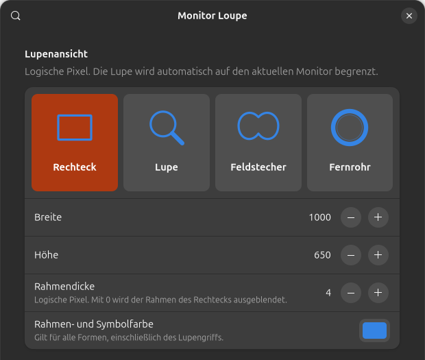
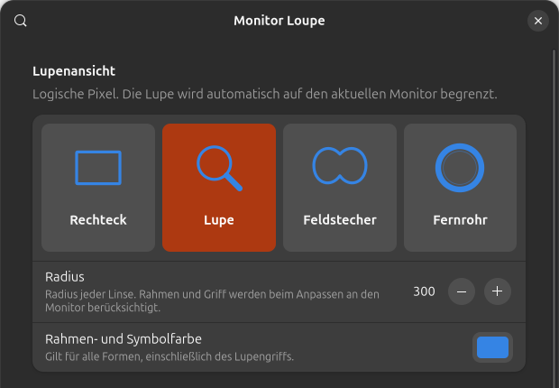

# GNOME Monitor Loupe

Eine Lupe für **GNOME Shell 50**, die dem Mauszeiger folgt und auf dessen Monitor
bleibt. Auch der vergrößerte Quellbereich bleibt innerhalb dieses Monitors.

[English documentation](README.md)

## Wähle deine Lupenansicht

| Rechteck | Lupe | Feldstecher | Fernrohr |
| :---: | :---: | :---: | :---: |
|  |  |  |  |
| Klassische rechteckige Ansicht | Runde Linse mit Griff | Zwei überlappende Linsen | Runde Ansicht mit breitem Rahmen |
| Breite, Höhe und Rahmendicke | Radius einstellbar | Radius pro Linse einstellbar | Radius einstellbar |

*Die Symbole veranschaulichen die vier Formen; sie sind keine Desktop-Screenshots.*

Die **Rahmen- und Symbolfarbe** ist für alle vier Ansichten frei wählbar. Die Lupe
folgt dem Mauszeiger und passt sich mitsamt Rahmen und Griff an den aktuellen Monitor an.
Wähle die Form über eines der **vier Symbolfelder ganz oben in den Einstellungen**.
Das aktive Feld ist hervorgehoben; darunter erscheinen die passenden Größenregler.

## Neue Einstellungen im Bild

Aktuelle Aufnahmen des Einstellungsfensters, jeweils mit dem Bereich „Lupenansicht“.

**Rechteck — Abmessungen, Rahmendicke und Farbe**



**Runde Formen — Radius und Farbe**



Klicke auf das Farbfeld, um eine Farbe auszuwählen. Mit Rahmendicke **0** blendest
du den Rechteckrahmen aus. Änderungen an der Ansicht werden sofort übernommen.

## Einstellungen

In der App **Erweiterungen** bei Monitor Loupe auf die Einstellungen klicken, oder:

```sh
gnome-extensions prefs monitor-loupe@sprites.github.io
```

- **Super + Alt + Mausrad** ist standardmäßig aktiv. Nach oben vergrößert,
  nach unten verkleinert. Die Funktion lässt sich ausschalten.
- **Zoomschritt:** standardmäßig 0,25×, einstellbar von 0,05× bis 5×.
  Beispiel: 2× → 2,25×. Die maximale Vergrößerung ist 32×.
- Aus dem ausgeschalteten Zustand beginnt der Zoom bei 1× plus einem Schritt.
  Beim Verkleinern auf 1× wird die Lupe ausgeschaltet.
- **Lupe ein-/ausschalten:** zeigt und bearbeitet das vorhandene GNOME-Kürzel
  (beispielsweise Alt+Super+L). Diese Änderung gilt systemweit und bleibt auch
  nach dem Deaktivieren der Erweiterung erhalten.
- **Vergrößern/Verkleinern:** eigene Tastenkürzel für den eingestellten
  Zoomschritt. Zunächst sind keine belegt, um bestehende Kürzel zu erhalten.
  Kürzel anklicken und die neue Kombination drücken. Rücktaste deaktiviert,
  Escape bricht ab. Eine noch freie Kombination wählen.
- **Form:** Rechteck (Standard), runde Lupe, Feldstecher mit zwei
  überlappenden Linsen oder Fernrohr. Außerhalb der Form
  bleibt der normale Desktop sichtbar.
- **Radius:** für die runden Formen von 60 bis 2160 logischen Pixeln wählbar,
  standardmäßig 300. Beim Feldstecher gilt der Radius für jede Linse. Die gesamte
  Form wird bei Bedarf proportional verkleinert, damit sie auf den Monitor passt.
- **Rahmen- und Symbolfarbe:** frei wählbare Farbe für alle Formen und den Lupengriff.
- **Rahmendicke:** beim Rechteck von 0 bis 20 logischen Pixeln, standardmäßig 2.
  Mit 0 wird der Rahmen ausgeblendet. Farbe und Dicke werden sofort übernommen.
- **Breite/Höhe:** für das Rechteck, standardmäßig 1000 × 650 logische Pixel. Änderungen werden
  sofort übernommen. Die Lupe wird höchstens so groß wie der aktuelle Monitor.
- **Zurücksetzen:** stellt die Erweiterungswerte wieder her. Das systemweite
  Ein/Aus-Kürzel bleibt erhalten.

GNOMEs eigene Zoomkürzel behalten ihre bisherige Schrittweite. Für den
einstellbaren Zoomschritt die eigenen Kürzel dieser Erweiterung verwenden.

## Installation

Das ZIP aus den [GitHub-Releases](https://github.com/sprites/gnome-monitor-loupe/releases)
herunterladen und installieren:

```sh
gnome-extensions install --force monitor-loupe@sprites.github.io.shell-extension.zip
```

Bei der ersten Installation einmal ab- und wieder anmelden. Anschließend:

```sh
gnome-extensions enable monitor-loupe@sprites.github.io
```

Wer die frühere private Version verwendet hat, deaktiviert diese vorher:

```sh
gnome-extensions disable monitor-loupe@local.rino
```

Better Desktop Zoom wird nicht benötigt. Dieselbe Mausradgeste sollte nur von
einer Erweiterung gleichzeitig verarbeitet werden.

Deaktivieren:

```sh
gnome-extensions disable monitor-loupe@sprites.github.io
```

Dabei werden die GNOME-Methoden und die konfigurierte Lupenansicht wiederhergestellt.
Die Fenstergröße überschreibt keine gespeicherten GNOME-Ansichtseinstellungen.
Bewusste Zoomaktionen ändern den Zoomfaktor und den Ein/Aus-Zustand der Systemlupe.

## Entwicklung und Status

`make test` prüft Geometrie, Zoom und den Lebenszyklus mit einer simulierten Shell.
`make pack` erstellt das installierbare ZIP in `dist/`.

Die Erweiterung verwendet interne GNOME-50-Methoden. Andere GNOME-Versionen sind
noch nicht freigegeben. Vor einer stabilen Veröffentlichung sind Praxistests mit
Mausrad, Monitorwechseln, unterschiedlicher Skalierung und Sperren/Entsperren nötig.
Bei einem geänderten GNOME-Compositor-Modifikator kann Mausrad-Zoom über
Anwendungsfenstern abweichen; GNOMEs Standard ist Super.

Fehler bitte mit GNOME-Version, Monitoranordnung und Skalierung unter
[GitHub Issues](https://github.com/sprites/gnome-monitor-loupe/issues) melden.

Lizenz: GPL-2.0-or-later, siehe [LICENSE](LICENSE).
