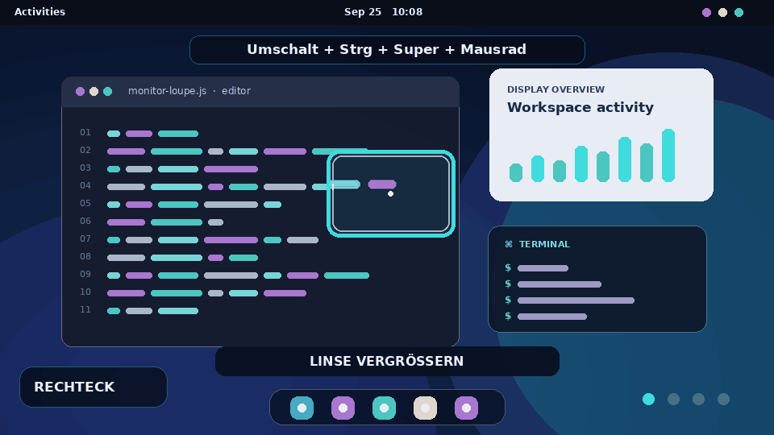
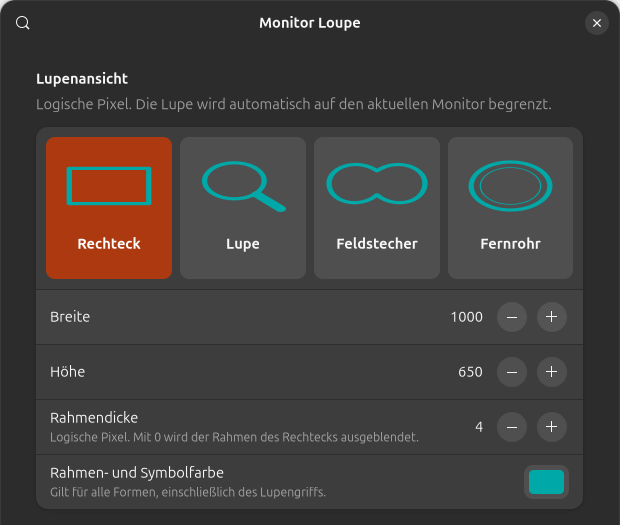
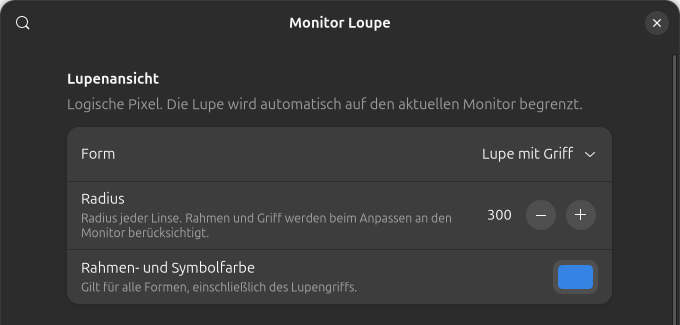
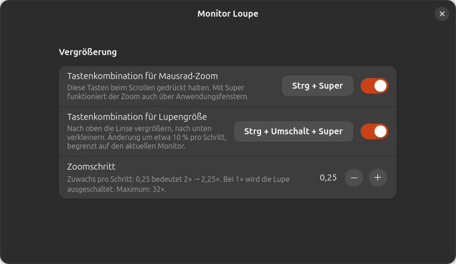

# GNOME Monitor Loupe

Eine Lupe für **GNOME Shell 48–51**, die dem Mauszeiger folgt. An Bildschirmrändern
bleibt sie auf dem Mauszeiger zentriert; GNOME schneidet nur den Teil ab, der
ausserhalb des sichtbaren Desktops liegt. An Monitorübergängen kann die Lupe auf
den Nachbarmonitor reichen.

[English documentation](README.md)

## Wähle deine Lupenansicht

| Rechteck | Lupe | Feldstecher | Fernrohr |
| :---: | :---: | :---: | :---: |
|  |  |  |  |
| Klassische rechteckige Ansicht | Runde Linse mit Griff | Zwei überlappende Linsen | Runde Ansicht mit breitem Rahmen |
| Breite, Höhe und Rahmendicke | Radius einstellbar | Radius pro Linse einstellbar | Radius einstellbar |

*Die Symbole veranschaulichen die vier Formen; sie sind keine Desktop-Screenshots.*

Die **Rahmen- und Symbolfarbe** sowie die **Rahmendicke** sind für alle vier Ansichten einstellbar.
Die Lupe passt sich mitsamt Rahmen und Griff an die aktuelle Monitorgrösse an.
Wähle die Form über eines der **vier Symbolfelder ganz oben in den Einstellungen**.
Das aktive Feld ist hervorgehoben; darunter erscheinen die passenden Größenregler.

## Die Lupenansichten in Bewegung

Die Animation zeigt, wie die Linse schwungvoll hin und her wandert, dabei
mehrfach größer und kleiner wird und weich zwischen allen vier Formen wechselt. Mit **Umschalt + Strg + Super +
Mausrad** lässt sich das Lupenfenster vergrössern und verkleinern: beim Rechteck
proportional, bei runden Formen über den Radius. Die Vergrößerungsstufe bleibt gleich.



*Die Desktop-Szene ist eine Illustration und keine Live-Aufnahme von GNOME.*
[Statisches PNG-Vorschaubild](docs/monitor-loupe-demo.png)

## Neue Einstellungen im Bild

Aufnahmen der Einstellungsbereiche „Lupenansicht“ und „Vergrößerung“.

**Rechteck — Abmessungen, Rahmendicke und Farbe**



**Runde Formen — Radius und Farbe**



Klicke auf das Farbfeld, um eine Farbe auszuwählen. Mit Rahmendicke **0** blendest
du den Rahmen aller Formen aus. Änderungen an der Ansicht werden sofort übernommen.

**Mausrad-Steuerung — Zoom und Lupengröße**



| Funktion | Standardkombination mit Mausrad | Wirkung |
| --- | --- | --- |
| Zoom | Strg + Super | Ändert die Vergrößerungsstufe des Inhalts. |
| Lupengröße | Umschalt + Strg + Super | Ändert den Radius oder skaliert das Rechteck proportional. |

Beide Tastenkombinationen lassen sich über ihren Kürzel-Button ändern:
anklicken, die gewünschten Zusatztasten gemeinsam drücken und loslassen.
Der jeweilige Schalter rechts daneben aktiviert oder deaktiviert die Funktion.
Die gewählten Kürzel bleiben beim Ausschalten erhalten. Bereits für die andere
Mausrad-Funktion verwendete Kombinationen werden beim Eingeben abgelehnt.

## Einstellungen

In der App **Erweiterungen** bei Monitor Loupe auf die Einstellungen klicken, oder:

```sh
gnome-extensions prefs monitor-loupe@sprites.github.io
```

- **Strg + Super + Mausrad** ist standardmäßig aktiv. Nach oben vergrößert,
  nach unten verkleinert. Unter **Vergrößerung → Tastenkombination für Mausrad-Zoom**
  den Tastenkürzel-Button anklicken, die gewünschte Kombination aus Strg, Alt,
  Umschalt und Super zusammen drücken und loslassen. Die Kombination wird direkt
  übernommen; Escape bricht ab, Rücktaste deaktiviert den Mausrad-Zoom.
  Der Ein-/Aus-Schalter direkt rechts neben dem Tastenkürzel-Button schaltet die
  Funktion um. Die gewählte Kombination bleibt dabei erhalten und lässt sich
  auch bei ausgeschaltetem Mausrad-Zoom ändern.
  Mit Super funktioniert der Zoom bei GNOMEs Standard-Compositor-Modifikator
  auch über Anwendungsfenstern.
- **Zoomschritt:** standardmäßig 0,25×, einstellbar von 0,05× bis 5×.
  Beispiel: 2× → 2,25×. Die maximale Vergrößerung ist 32×.
- **Lupengröße per Mausrad:** standardmäßig **Umschalt + Strg + Super + Mausrad**.
  Nach oben vergrößert die Linse, nach unten verkleinert sie. Runde Formen ändern
  den Radius; beim Rechteck werden Breite und Höhe proportional skaliert.
  Ein Schritt skaliert die Größe mit dem Faktor 1,1 beziehungsweise 1/1,1.
  Der Radius bleibt zwischen 60 und 2160 logischen Pixeln; das Rechteck mindestens
  160 × 90 und höchstens 7680 × 4320. Die Obergrenze berücksichtigt zusätzlich den
  Monitor unter dem Mauszeiger. Die Vergrößerungsstufe bleibt dabei gleich.
  Unter **Vergrößerung → Tastenkombination für Lupengröße** lässt sich das Kürzel ändern oder
  die Funktion mit dem Schalter daneben ausschalten. Zoom und Größenänderung
  verwenden unterschiedliche Tastenkombinationen. Die Größenänderung wird sofort
  übernommen und gespeichert. Beim Bearbeiten des Kürzels deaktiviert Rücktaste
  die Größensteuerung; Escape bricht die Eingabe ab.
- Aus dem ausgeschalteten Zustand beginnt der Zoom bei 1× plus einem Schritt.
  Beim Verkleinern auf 1× wird die Lupe ausgeschaltet.
- **Lupe ein-/ausschalten:** zeigt und bearbeitet das vorhandene GNOME-Kürzel
  (beispielsweise Alt+Super+L). Diese Änderung gilt systemweit und bleibt auch
  nach dem Deaktivieren der Erweiterung erhalten.
- **Vergrößern/Verkleinern:** eigene Tastenkürzel für den eingestellten
  Zoomschritt. Zunächst sind keine belegt, um bestehende Kürzel zu erhalten.
  Kürzel anklicken und die neue Kombination drücken. Rücktaste deaktiviert,
  Escape bricht ab. Eine noch freie Kombination wählen.
- **Form:** Rechteck (Standard), runde Lupe, Feldstecher mit zwei
  überlappenden Linsen oder Fernrohr. Außerhalb der Form
  bleibt der normale Desktop sichtbar.
- **Radius:** für die runden Formen von 60 bis 2160 logischen Pixeln wählbar,
  standardmäßig 300. Beim Feldstecher gilt der Radius für jede Linse. Die gesamte
  Form wird bei Bedarf proportional verkleinert, damit sie auf den Monitor passt.
- **Rahmen- und Symbolfarbe:** frei wählbare Farbe für alle Formen und den Lupengriff.
- **Rahmendicke:** bei allen Formen von 0 bis 20 logischen Pixeln, standardmäßig 2.
  Mit 0 wird der Rahmen ausgeblendet. Farbe und Dicke werden sofort übernommen.
- **Breite/Höhe:** für das Rechteck, standardmäßig 1000 × 650 logische Pixel. Änderungen werden
  sofort übernommen. Die Lupe wird höchstens so gross wie der aktuelle Monitor.
- **Zurücksetzen:** stellt die Erweiterungswerte wieder her. Das systemweite
  Ein/Aus-Kürzel bleibt erhalten.

GNOMEs eigene Zoomkürzel behalten ihre bisherige Schrittweite. Für den
einstellbaren Zoomschritt die eigenen Kürzel dieser Erweiterung verwenden.

## Installation

Das ZIP aus den [GitHub-Releases](https://github.com/sprites/gnome-monitor-loupe/releases)
herunterladen und installieren:

```sh
gnome-extensions install --force monitor-loupe@sprites.github.io.shell-extension.zip
```

Bei der ersten Installation einmal ab- und wieder anmelden. Anschließend:

```sh
gnome-extensions enable monitor-loupe@sprites.github.io
```

Better Desktop Zoom wird nicht benötigt. Dieselbe Mausradgeste sollte nur von
einer Erweiterung gleichzeitig verarbeitet werden.

Deaktivieren:

```sh
gnome-extensions disable monitor-loupe@sprites.github.io
```

Dabei werden die GNOME-Methoden und die konfigurierte Lupenansicht wiederhergestellt.
Die Fenstergröße überschreibt keine gespeicherten GNOME-Ansichtseinstellungen.
Bewusste Zoomaktionen ändern den Zoomfaktor und den Ein/Aus-Zustand der Systemlupe.

## Entwicklung und Status

`make test` prüft Geometrie, Zoom und den Lebenszyklus mit einer simulierten Shell.
`make pack` erstellt das installierbare ZIP in `dist/`.

Der abgestimmte Ablauf für GNOME- und GitHub-Releases steht in der
[Release-Anleitung](docs/release.de.md). `make release-candidate` baut zuerst
das GNOME-Upload-Paket mit der nächsten Nummer, ohne die Versionsnummer auf
GitHub oder lokal vorwegzunehmen.

Version 15 ist für **GNOME Shell 48, 49, 50 und 51** freigegeben.
Isolierte Wayland-VM-Tests auf GNOME 48.0, 49.1, 50.0 und 51.0 prüfen Laden,
Formwechsel und wiederholtes Deaktivieren/Aktivieren. Die Shader-Anpassung für
GNOME 51 wurde unter GNOME 50.0 und 51.0 geprüft, einschließlich einer Bildprüfung
der runden Formen unter GNOME 51. Vollständige Tests mit physischen Monitoren
und Eingabegeräten stehen noch aus.

Die Erweiterung verwendet interne GNOME-Lupenmethoden. Zur Laufzeitprüfung auf
jeder unterstützten Version gehören Mausrad, Monitorwechsel, unterschiedliche
Skalierung und Sperren/Entsperren.
Bei einem geänderten GNOME-Compositor-Modifikator kann Mausrad-Zoom über
Anwendungsfenstern abweichen; GNOMEs Standard ist Super.

Fehler bitte mit GNOME-Version, Monitoranordnung und Skalierung unter
[GitHub Issues](https://github.com/sprites/gnome-monitor-loupe/issues) melden.

Lizenz: GPL-2.0-or-later, siehe [LICENSE](LICENSE).
