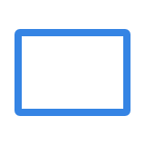
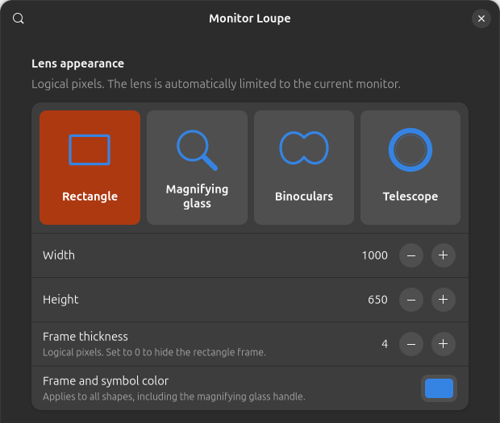
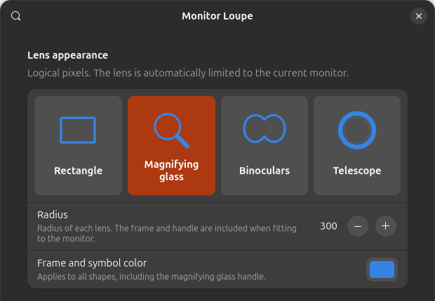

# GNOME Monitor Loupe

A pointer-following magnifier for **GNOME Shell 50**. The lens and the magnified
source area stay inside the monitor under your pointer, including at monitor
edges and with displays arranged above, below or to the left of each other.

[Deutsche Anleitung](README.de.md)

## Choose your lens

| Rectangle | Magnifying glass | Binoculars | Telescope |
| :---: | :---: | :---: | :---: |
|  |  |  |  |
| Classic rectangular view | Round lens with a handle | Two overlapping lenses | Round view with a broad rim |
| Width, height and frame thickness | Adjustable radius | Adjustable radius per lens | Adjustable radius |

*Symbols illustrate the four shapes; they are not desktop screenshots.*

Choose a **frame and symbol color** for all four views. The lens follows your
pointer and scales down to fit the current monitor, including its frame and handle.
Select a shape by clicking one of the **four illustrated tiles at the top of the
preferences**. The selected tile is highlighted; the matching size controls appear below.

## Why Monitor Loupe

Monitor Loupe is designed for people who work with large or multiple displays:

- **Four adjustable shapes:** set width and height for the rectangle or the
  radius for round lenses. Choose the frame color and rectangle frame thickness.
- **True multi-monitor behavior:** the lens follows the pointer to the monitor
  it is currently on, including mixed layouts and different display sizes.
- **Precise bounds:** both the visible lens window and the magnified source area
  are clamped to that monitor, so content never spills across a display edge.

## Settings preview

Actual captures of the current preferences window (appearance section).

**Rectangle — dimensions, frame thickness and color**



**Round shapes — radius and color**



Click the color swatch to choose a color. Set rectangle frame thickness to **0**
to hide its border. Appearance changes apply immediately.

## Controls and preferences

Open Monitor Loupe’s preferences in the GNOME Extensions app, or run:

```sh
gnome-extensions prefs monitor-loupe@sprites.github.io
```

- **Super + Alt + scroll wheel** zooms in and out, enabled by default. It can be
  disabled in preferences. Vertical smooth scrolling is accumulated into steps.
- **Zoom step** is adjustable from 0.05× to 5×. The default adds or subtracts
  0.25× per step; for example, 2× → 2.25×. Maximum magnification is 32×.
- Zooming in from off starts at 1× plus one step. Zooming out to 1× turns the
  magnifier off and preserves the last useful factor for the system toggle.
- **Toggle magnifier** edits GNOME’s existing system shortcut. Click it and
  press a new combination. This setting also applies after disabling or removing
  the extension. The currently configured system shortcut is preserved on install.
- **Zoom in / out shortcuts** use the configured step. They are initially unset
  to avoid conflicts with existing desktop shortcuts. Backspace clears a shortcut;
  Escape cancels editing. Choose combinations not already used by another app.
- **Shape:** rectangle (default), a round magnifying glass with a handle,
  binoculars with overlapping lenses, or a telescope.
  The normal desktop remains visible outside the shape. Changes apply immediately.
- **Radius:** 60–2160 logical pixels for round shapes, initially 300. For
  binoculars this applies to each lens. The whole shape scales down proportionally
  when needed to fit the current monitor, including its frame and handle.
- **Frame and symbol color:** choose a color for all shapes and the magnifying glass handle.
- **Frame thickness:** 0–20 logical pixels for the rectangle, initially 2.
  Set to 0 to hide the frame. Color and thickness changes apply immediately.
- **Lens width and height** apply to the rectangle and are adjustable in logical pixels, initially
  1000 × 650. Changes apply immediately. Oversized dimensions are limited to the
  current monitor; physical pixel size follows the display scaling.
- **Reset extension settings** restores these defaults, without changing the
  system toggle shortcut.

GNOME’s own zoom-in/out shortcuts retain their system-defined zoom increment.
Assign different zoom shortcuts in Monitor Loupe to use its adjustable step.
Preferences are available in English and German, following the desktop language.

## Installation

Download `monitor-loupe@sprites.github.io.shell-extension.zip` from
[GitHub Releases](https://github.com/sprites/gnome-monitor-loupe/releases), then:

```sh
gnome-extensions install --force monitor-loupe@sprites.github.io.shell-extension.zip
```

On a first installation, log out and back in so GNOME discovers the extension.
Then enable it:

```sh
gnome-extensions enable monitor-loupe@sprites.github.io
```

If you used the earlier private version, disable it before enabling this version:

```sh
gnome-extensions disable monitor-loupe@local.rino
```

Better Desktop Zoom is **not required**. Only one extension should handle the
same scroll gesture or keyboard shortcut at a time.

Disable Monitor Loupe with:

```sh
gnome-extensions disable monitor-loupe@sprites.github.io
```

Disabling disconnects input handlers, removes its zoom shortcuts and restores the
original GNOME magnifier methods and configured view. Lens geometry does not
overwrite GNOME’s saved lens/view settings. User zoom actions update GNOME’s
magnifier-enabled state and magnification factor.

## Development

Requires Node.js 20+, GNU Make, `gnome-extensions`, GLib’s `glib-compile-schemas`
and gettext’s `msgfmt`.

```sh
make test
make pack
```

The installable ZIP is written to `dist/`. Tests cover monitor/source bounds,
pointer alignment, configurable dimensions, fractional zoom steps, input handling
and extension cleanup. Lifecycle tests use a simulated Shell boundary and do not
replace testing on a real GNOME desktop.

This extension uses internal GNOME magnifier methods and must be checked before
adding support for another GNOME version. Scroll interception relies on GNOME’s
compositor modifier (Super by default). Nonstandard compositor modifier settings
can affect scroll zoom over application windows.

Before a stable release, check on GNOME 50: toggle/zoom shortcuts, wheel events
over native Wayland and XWayland applications, smooth scrolling, monitor edges,
mixed scaling, monitor hotplug, screen locking, and repeated enable/disable.

Report issues with the GNOME version, monitor layout, scaling and reproduction
steps at [GitHub Issues](https://github.com/sprites/gnome-monitor-loupe/issues).

## License

GPL-2.0-or-later. See [LICENSE](LICENSE).
