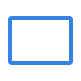
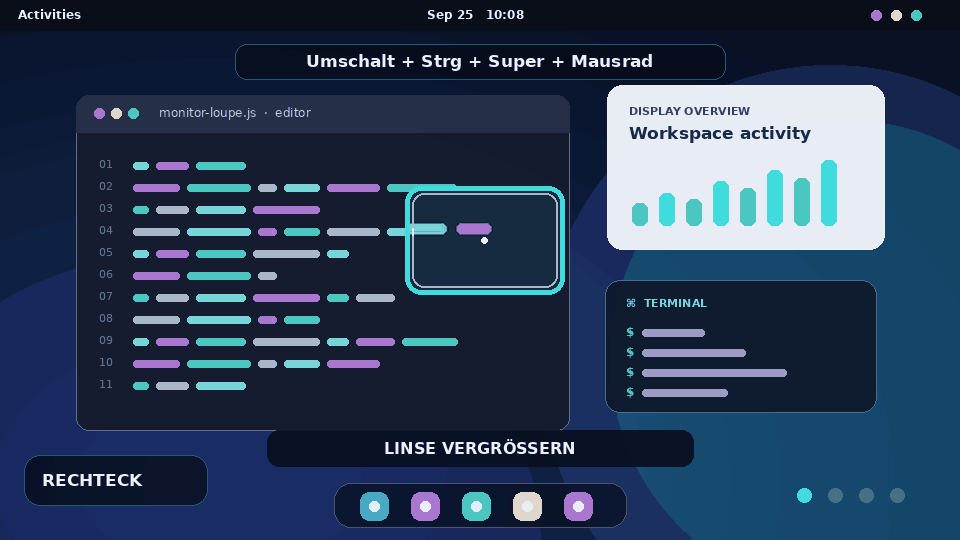
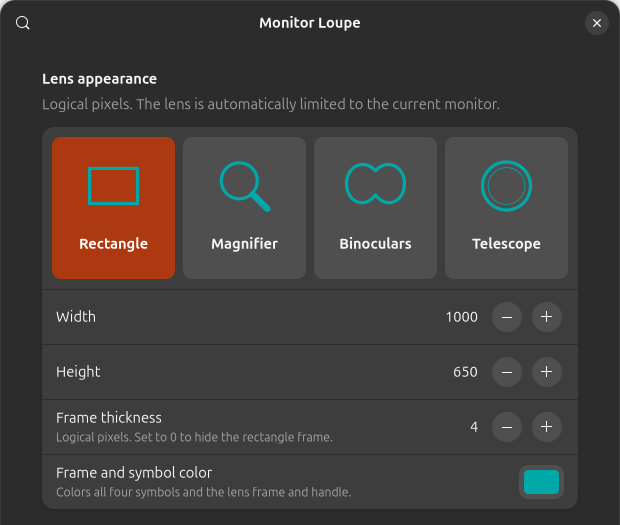
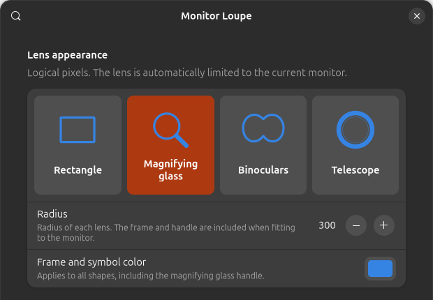
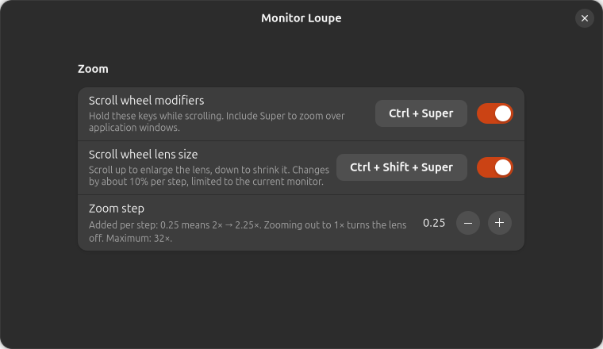

# GNOME Monitor Loupe

A pointer-following magnifier for **GNOME Shell 48–51**. At screen edges the lens
stays centered on the pointer and GNOME clips the part beyond the visible desktop.
At monitor transitions the lens can extend onto a neighboring display.

[Deutsche Anleitung](README.de.md)

## Choose your lens

| Rectangle | Magnifier | Binoculars | Telescope |
| :---: | :---: | :---: | :---: |
|  |  |  |  |
| Classic rectangular view | Round lens with a handle | Two overlapping lenses | Round view with a broad rim |
| Width, height and frame thickness | Adjustable radius | Adjustable radius per lens | Adjustable radius |

*Symbols illustrate the four shapes; they are not desktop screenshots.*

Choose a **frame and symbol color** for all four views. The lens follows your
pointer and scales down to fit the current monitor, including its frame and handle.
Select a shape by clicking one of the **four illustrated tiles at the top of the
preferences**. The selected tile is highlighted; the matching size controls appear below.

## See the views in motion

The animation shows the lens swooping back and forth while repeatedly growing
and shrinking, with smooth transitions between all four shapes. **Shift + Ctrl + Super + scroll wheel** enlarges
and shrinks the lens window: rectangles scale proportionally, while round shapes
change their radius. Content magnification stays unchanged.



*The desktop scene is an illustration, not a capture of a live GNOME session.*
[Static PNG preview](docs/monitor-loupe-demo.png)

## Why Monitor Loupe

Monitor Loupe is designed for people who work with large or multiple displays:

- **Four adjustable shapes:** set width and height for the rectangle or the
  radius for round lenses. Choose the frame color and thickness for every shape.
- **True multi-monitor behavior:** the lens follows the pointer to the monitor
  it is currently on, including mixed layouts and different display sizes.
- **Pointer-centered at screen edges:** the lens stays centered on the pointer;
  GNOME clips the invisible portion at physical desktop edges. At monitor
  transitions, the lens can extend onto the neighboring display.

## Settings preview

Captures of the lens appearance and zoom settings.

**Rectangle — dimensions, frame thickness and color**



**Round shapes — radius and color**



Click the color swatch to choose a color. Set frame thickness to **0**
to hide the border on every shape. Appearance changes apply immediately.

**Scroll-wheel controls — zoom and lens size**



| Function | Default modifiers with the scroll wheel | Effect |
| --- | --- | --- |
| Zoom | Ctrl + Super | Changes the magnification of the content. |
| Lens size | Shift + Ctrl + Super | Changes the radius or scales the rectangle proportionally. |

To edit either combination, click its shortcut button, press the modifier keys
together, then release them. Each adjacent switch enables or disables its
function while preserving the chosen shortcut. A combination already assigned
to the other scroll-wheel function is rejected when entering a new shortcut.

## Controls and preferences

Open Monitor Loupe’s preferences in the GNOME Extensions app, or run:

```sh
gnome-extensions prefs monitor-loupe@sprites.github.io
```

- **Ctrl + Super + scroll wheel** zooms in and out, enabled by default. Under
  **Zoom → Scroll wheel modifiers**, click the shortcut button, press the desired
  combination of Ctrl, Alt, Shift and Super together, then release the keys.
  The combination is saved immediately; Escape cancels and Backspace disables
  scroll zoom. The on/off switch directly to the right of the shortcut button
  toggles the feature while preserving the chosen combination. You can edit the
  combination even when scroll zoom is off.
  Include Super to zoom over application windows with GNOME’s default compositor
  modifier. Vertical smooth scrolling is accumulated into steps.
- **Zoom step** is adjustable from 0.05× to 5×. The default adds or subtracts
  0.25× per step; for example, 2× → 2.25×. Maximum magnification is 32×.
- **Scroll-wheel lens size:** defaults to **Shift + Ctrl + Super + scroll wheel**.
  Scroll up to enlarge the lens and down to shrink it. Round shapes change their
  radius; rectangles scale width and height together to preserve their aspect ratio.
  Each step scales the size by 1.1 or its inverse. The radius stays within
  60–2160 logical pixels; rectangles stay within 160 × 90 and 7680 × 4320.
  The upper limit also accounts for the monitor under the pointer. Magnification
  stays unchanged. Edit the shortcut under **Zoom → Scroll wheel lens size**, or disable
  it with the adjacent switch. Zoom and resizing use separate modifier combinations.
  Size changes apply immediately and are saved. When editing the shortcut,
  Backspace disables resizing and Escape cancels the edit.
- Zooming in from off starts at 1× plus one step. Zooming out to 1× turns the
  magnifier off and preserves the last useful factor for the system toggle.
- **Toggle magnifier** edits GNOME’s existing system shortcut. Click it and
  press a new combination. This setting also applies after disabling or removing
  the extension. The currently configured system shortcut is preserved on install.
- **Zoom in / out shortcuts** use the configured step. They are initially unset
  to avoid conflicts with existing desktop shortcuts. Backspace clears a shortcut;
  Escape cancels editing. Choose combinations not already used by another app.
- **Shape:** rectangle (default), a round magnifying glass with a handle,
  binoculars with overlapping lenses, or a telescope.
  The normal desktop remains visible outside the shape. Changes apply immediately.
- **Radius:** 60–2160 logical pixels for round shapes, initially 300. For
  binoculars this applies to each lens. The whole shape scales down proportionally
  when needed to fit the current monitor, including its frame and handle.
- **Frame and symbol color:** choose a color for all shapes and the magnifying glass handle.
- **Frame thickness:** 0–20 logical pixels for every shape, initially 2.
  Set to 0 to hide the frame. Color and thickness changes apply immediately.
- **Lens width and height** apply to the rectangle and are adjustable in logical pixels, initially
  1000 × 650. Changes apply immediately. Oversized dimensions are limited to the
  current monitor; physical pixel size follows the display scaling.
- **Reset extension settings** restores these defaults, without changing the
  system toggle shortcut.

GNOME’s own zoom-in/out shortcuts retain their system-defined zoom increment.
Assign different zoom shortcuts in Monitor Loupe to use its adjustable step.
Preferences are available in English and German, following the desktop language.

## Installation

Download `monitor-loupe@sprites.github.io.shell-extension.zip` from
[GitHub Releases](https://github.com/sprites/gnome-monitor-loupe/releases), then:

```sh
gnome-extensions install --force monitor-loupe@sprites.github.io.shell-extension.zip
```

On a first installation, log out and back in so GNOME discovers the extension.
Then enable it:

```sh
gnome-extensions enable monitor-loupe@sprites.github.io
```

Better Desktop Zoom is **not required**. Only one extension should handle the
same scroll gesture or keyboard shortcut at a time.

Disable Monitor Loupe with:

```sh
gnome-extensions disable monitor-loupe@sprites.github.io
```

Disabling disconnects input handlers, removes its zoom shortcuts and restores the
original GNOME magnifier methods and configured view. Lens geometry does not
overwrite GNOME’s saved lens/view settings. User zoom actions update GNOME’s
magnifier-enabled state and magnification factor.

## Development

Requires Node.js 20+, GNU Make, `gnome-extensions`, GLib’s `glib-compile-schemas`
and gettext’s `msgfmt`.

```sh
make test
make pack
```

The installable ZIP is written to `dist/`. Tests cover monitor edge positioning,
pointer alignment, configurable dimensions, fractional zoom steps, input handling
and extension cleanup. Lifecycle tests use a simulated Shell boundary and do not
replace testing on a real GNOME desktop.

Version 14 declares support for **GNOME Shell 48, 49, 50 and 51**.
The extension has been used on GNOME 50. Compatibility checks against the original
magnifier classes of GNOME 48, 49 and 51 passed with simulated desktop objects.
Full desktop tests on those versions have not been performed; support is enabled
on the basis of these preliminary checks.

This extension uses internal GNOME magnifier methods. Scroll interception relies on GNOME’s
compositor modifier (Super by default). Nonstandard compositor modifier settings
can affect scroll zoom over application windows.

For runtime validation on each supported GNOME version, check: toggle/zoom shortcuts, wheel events
over native Wayland and XWayland applications, smooth scrolling, monitor edges,
mixed scaling, monitor hotplug, screen locking, and repeated enable/disable.

Report issues with the GNOME version, monitor layout, scaling and reproduction
steps at [GitHub Issues](https://github.com/sprites/gnome-monitor-loupe/issues).

## License

GPL-2.0-or-later. See [LICENSE](LICENSE).
